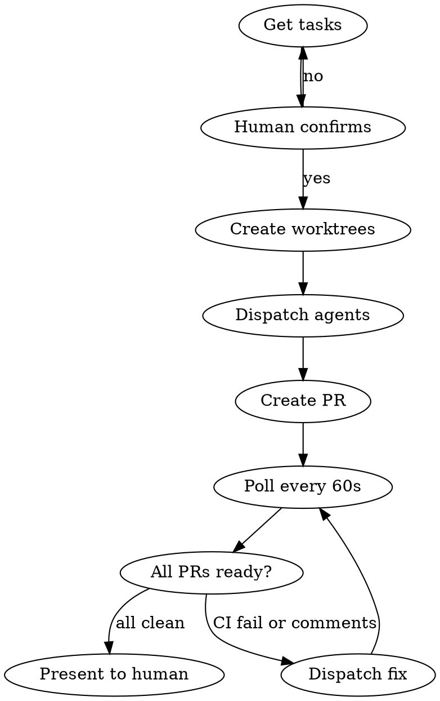

# Smithers

## Prerequisites

**Before using this skill**, copy the smithers-worker agent to `~/.claude/agents/smithers-worker.md`:

<details>
<summary><strong>smithers-worker.md</strong> (click to expand)</summary>

```markdown
---
name: smithers-worker
description: Implementation worker for smithers skill. Implements tasks in isolated worktrees, creates PRs. Use when smithers dispatches parallel implementation work.
tools: Read, Write, Edit, Bash, Grep, Glob
model: sonnet
permissionMode: acceptEdits
---

You are a Smithers Worker - an autonomous implementation agent.

## Your Mission

You implement a single task in an isolated git worktree and create a PR.

## Workflow

1. **Understand the task** - Read the task description carefully
2. **Implement using TDD** - Write failing test first, then implementation
3. **Run tests** - All tests must pass before proceeding
4. **Commit and push** - Use conventional commit format
5. **Create PR** - Title must contain the task identifier
6. **Report back** - Return PR URL and evidence

## Addressing Review Comments (When Re-dispatched)

If you are dispatched to address review comments on an existing PR:

1. **Fetch all review comments:**
   ```bash
   gh api repos/OWNER/REPO/pulls/PR_NUMBER/comments
   gh api repos/OWNER/REPO/pulls/PR_NUMBER/reviews
   ```

2. **For each comment/suggestion:**
   - Understand what the reviewer is asking
   - Make the requested change
   - Commit with message: `fix: address review - <brief description>`

3. **Resolve each conversation after addressing:**
   ```bash
   # Get the GraphQL node ID for the review thread
   gh api graphql -f query='
     query($owner: String!, $repo: String!, $pr: Int!) {
       repository(owner: $owner, name: $repo) {
         pullRequest(number: $pr) {
           reviewThreads(first: 100) {
             nodes {
               id
               isResolved
               comments(first: 1) {
                 nodes { body }
               }
             }
           }
         }
       }
     }
   ' -f owner=OWNER -f repo=REPO -F pr=PR_NUMBER

   # Resolve each unresolved thread
   gh api graphql -f query='
     mutation($threadId: ID!) {
       resolveReviewThread(input: {threadId: $threadId}) {
         thread { isResolved }
       }
     }
   ' -f threadId=THREAD_ID
   ```

4. **Push changes and report back**

**CRITICAL:** You MUST resolve the conversation thread after addressing each comment. Unresolved threads block PR readiness.

## Constraints

- Stay in your assigned worktree directory
- Do not modify files outside task scope
- PR title MUST contain the task identifier
- All tests must pass before creating PR
- No unrelated refactors or "improvements"
- ALWAYS resolve conversation threads after addressing comments

## Required Output

When complete, return:
- PR URL
- Branch name
- Test command run
- Test output (last 20 lines showing pass)
- List of files changed
- Commit hash

If you cannot complete the task, explain what's blocking you.
```

</details>

---

## Overview

Smithers takes a list of tasks, creates isolated worktrees, dispatches parallel subagents to implement each, handles automated PR reviews, and only presents PRs for human review after CI passes and all review comments are addressed.

**Core principle:** Humans review polished PRs, not work-in-progress.

**Announce at start:** "I'm using the smithers skill to dispatch parallel workers."

## When to Use

- You have multiple independent tasks to implement
- You want fully autonomous implementation through to PR-ready state
- You trust automated review cycles before human involvement

## When NOT to Use

- Tasks are interdependent (would cause merge conflicts)
- Requirements are unclear (need human input during implementation)
- You want human oversight during implementation

## Iron Laws

1. Human confirms task selection before dispatch
2. One worktree per task - no shared git state
3. CI must pass before presenting to human
4. All review comments must be addressed AND threads resolved
5. Never skip the review loop - iterate until clean

## The Smithers Loop



## Execution Steps

### Step 1: Get Tasks

Determine task source in this order:

**1. Natural language from user:**
```
"implement login and fix the navbar"
"do X, Y, and Z"
"I want you to add auth, update the API, and write tests"
```
Parse into discrete tasks. Generate IDs: `smithers-1`, `smithers-2`, etc.

**2. GitHub issues (if `--from-issues` specified):**
```bash
gh issue list --label ready --json number,title,body --limit 10
```
Use issue number as ID: `issue-123`, `issue-456`, etc.

**3. beads (if `bd` CLI available and no other source):**
```bash
bd ready --json
```
Filter for tasks without gates. Use bead ID: `bd-123`, etc.

**4. None of the above:**
Ask user: "What tasks should I implement in parallel?"

### Step 2: Detect Review Bots

Check which automated reviewers are configured:

```bash
# Check for roborev
ls .roborev.yaml .roborev.yml 2>/dev/null && echo "roborev: enabled"

# Codex and CodeRabbit are typically org-level - assume enabled if repo is on GitHub
```

### Step 3: Present for Confirmation

Display parsed tasks to user:

```
Ready to dispatch 3 tasks:

1. [smithers-1] Add user authentication
2. [smithers-2] Fix navbar responsive layout
3. [smithers-3] Update API error handling

Review bots detected: CodeRabbit, roborev

Proceed? (y/n/select specific)
```

**STOP HERE.** Wait for explicit user confirmation.

### Step 4: Create Worktrees

For each confirmed task:

```bash
# Ensure .gitignore covers worktrees
grep -q "^\.worktrees/" .gitignore || echo ".worktrees/" >> .gitignore

# Create isolated worktree (ID is smithers-N, issue-N, or bd-N)
git worktree add ".worktrees/<ID>" -b "feature/<ID>-<slug>"
```

### Step 5: Dispatch Parallel Subagents

Launch one `smithers-worker` subagent per task in parallel.

**Dispatch command:**

```
Task(
  subagent_type="smithers-worker",
  prompt="Implement task <ID>: <Title>

Working directory: .worktrees/<ID>
Description: <Description>

Return: PR URL, branch, test output, files changed, commit hash"
)
```

**Critical:** Use `subagent_type="smithers-worker"` - NOT `general-purpose`. The smithers-worker agent is configured with Write/Edit/Bash tools and acceptEdits permission mode.

### Step 6: Monitor and Address Reviews (Polling Loop)

After PRs created, enter the polling loop. **Check every 60 seconds** until all PRs are ready.

**Polling procedure (repeat every 60 seconds):**

```bash
# For each PR, check status
gh pr view PR_NUMBER --json state,mergeable,reviewDecision,statusCheckRollup,reviews,comments
```

**Per-PR status check (MUST run both):**

```bash
# 1. CI status (did checks pass?)
gh pr checks PR_NUMBER

# 2. Review decision (CRITICAL - don't skip this!)
gh pr view PR_NUMBER --json reviewDecision --jq '.reviewDecision'
# Returns: APPROVED, CHANGES_REQUESTED, REVIEW_REQUIRED, or null
```

| Check | Command | Ready when |
|-------|---------|------------|
| CI | `gh pr checks PR_NUMBER` | All checks pass (exit code 0) |
| Reviews | `gh pr view --json reviewDecision` | `APPROVED` or `null` (NOT `CHANGES_REQUESTED`) |
| Threads | See below | All review threads resolved |

**Check for unresolved review threads:**

```bash
gh api graphql -f query='
  query($owner: String!, $repo: String!, $pr: Int!) {
    repository(owner: $owner, name: $repo) {
      pullRequest(number: $pr) {
        reviewThreads(first: 100) {
          nodes {
            isResolved
            comments(first: 1) { nodes { body } }
          }
        }
      }
    }
  }
' -f owner=OWNER -f repo=REPO -F pr=PR_NUMBER --jq '.data.repository.pullRequest.reviewThreads.nodes | map(select(.isResolved == false)) | length'
```

**Ready when:** Returns `0` (no unresolved threads)

**CRITICAL:**
- `gh pr checks` showing "pass" for CodeRabbit only means the bot ran - NOT that the review was approved
- You MUST check `reviewDecision` separately
- You MUST check that ALL review threads are resolved (not just comments addressed)

**On each poll iteration:**

1. Check all PRs for CI status + review status + unresolved threads
2. If CI fails: dispatch smithers-worker to fix, push, reset iteration count for that PR
3. If unresolved review threads exist: dispatch smithers-worker to address comments AND resolve threads, push, reset iteration count
4. If PR clean (CI pass + reviewDecision OK + zero unresolved threads): mark as ready
5. If 3+ fix iterations on same PR: escalate to human, stop polling that PR
6. If ALL PRs ready: exit loop, proceed to Step 7
7. Otherwise: **wait 60 seconds**, then poll again

**Critical:** Do not stop polling until ALL PRs are ready or escalated. Keep checking every 60 seconds.

### Step 7: Present to Human

Only when ALL PRs have CI passing and no unresolved comments:

```
All PRs ready for your review:

1. PR #123: Add user authentication (smithers-1)
   https://github.com/org/repo/pull/123
   CI: passing | Reviews: approved

2. PR #124: Fix navbar responsive layout (smithers-2)
   https://github.com/org/repo/pull/124
   CI: passing | Reviews: approved
```

### Step 8: Cleanup After Merge

```bash
# Always: remove worktree
git worktree remove ".worktrees/<ID>"

# If task was from beads: close it
bd close <ID> --reason "PR merged"

# If task was from GitHub issue: close it
gh issue close <NUMBER> --reason completed
```

## Quick Reference

| Phase | Action |
|-------|--------|
| Get Tasks | Natural language, `--from-issues`, beads, or ask |
| Detect | Check for roborev config |
| Confirm | Show parsed list, wait for approval |
| Isolate | Create worktree per task |
| Dispatch | Parallel smithers-worker agents |
| Poll | Check all PRs every 60s |
| Fix | Dispatch fixes for CI failures or comments |
| Present | Show PR links when all clean |
| Cleanup | Remove worktrees, close tasks if applicable |

## Red Flags

| Thought | Reality |
|---------|---------|
| "CI is probably fine" | Wait for CI. No exceptions. |
| "CodeRabbit check passed, we're good" | **NO!** Check passed = bot ran. Check `reviewDecision` for APPROVED. |
| "I addressed the comment" | Did you RESOLVE the thread? Unresolved threads block readiness. |
| "Minor comment, human can handle" | Address ALL comments AND resolve threads first. |
| "Skip worktree, use current dir" | Parallel agents corrupt git state. |
| "User said go, skip the list" | ALWAYS confirm selection. |

## Failure Modes

| Problem | Solution |
|---------|----------|
| Worktree fails | Check branch exists, clean orphans |
| CI stuck | gh run list, re-trigger if needed |
| 3+ review iterations | Escalate to human |
| Merge conflicts | Run tasks sequentially instead |

## Requirements

- [gh](https://cli.github.com/) CLI
- Git worktree support
- smithers-worker agent (see Prerequisites above)

### Optional Integrations

- [beads](https://github.com/steveyegge/beads) - Auto-detects ready tasks via `bd ready`
- [roborev](https://github.com/wesm/roborev) - Local code review
- CodeRabbit, Codex - Org-level PR review bots
