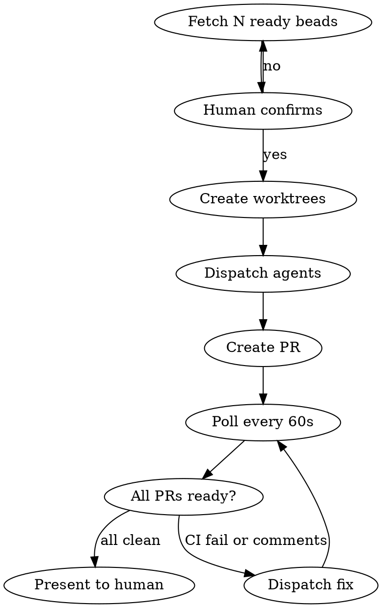

# Smithers

## Prerequisites

**Before using this skill**, copy the smithers-worker agent to `~/.claude/agents/smithers-worker.md`.

**Read:** [references/smithers-worker.md](./references/smithers-worker.md)

---

## Overview

Smithers fetches low-hanging ready beads, creates isolated worktrees, dispatches parallel subagents to implement each, handles automated PR reviews (Codex, CodeRabbit, roborev), and only presents PRs for human review after CI passes and all review comments are addressed.

**Core principle:** Humans review polished PRs, not work-in-progress.

**Announce at start:** "I'm using the smithers skill to dispatch parallel workers for ready beads."

## When to Use

- Ready beads exist (bd ready returns tasks)
- Tasks have no gates (no needs-spec, no needs-verification)
- You want fully autonomous implementation through to PR-ready state
- You trust automated review cycles before human involvement

## When NOT to Use

- Tasks have needs-spec (requirements unclear)
- Tasks have needs-verification (need human QA during implementation)
- Tasks are interdependent (would cause merge conflicts)
- You want human oversight during implementation

## Iron Laws

1. Human confirms task selection before dispatch
2. One worktree per bead - no shared git state
3. CI must pass before presenting to human
4. All review comments must be addressed AND threads resolved
5. Never skip the review loop - iterate until clean

## Progress Checklist

Copy this checklist and track progress:

- [ ] Fetched ready beads (`bd ready --json`)
- [ ] Filtered to beads with no gates (no `needs-spec`, no `needs-verification`)
- [ ] User confirmed bead selection
- [ ] Worktrees created (one per bead)
- [ ] Workers dispatched (one per bead)
- [ ] PRs created
- [ ] Polling loop running (every 60s)
- [ ] For each PR: CI passing (`gh pr checks`)
- [ ] For each PR: reviewDecision is `APPROVED` or `null` (not `CHANGES_REQUESTED`)
- [ ] For each PR: unresolved review threads = 0
- [ ] All clean PRs presented to human
- [ ] After merge: worktrees removed and beads closed

## Configuration

| Setting | Default | Rationale |
|---------|---------|-----------|
| Default batch size | 3 beads | Enough parallelism to save time without overwhelming CI and the human review queue |
| Poll interval | 60s | Balances responsiveness with GitHub API rate limits and typical CI latency |
| Escalation threshold | 3 fix iterations | Most issues resolve in 1–2 cycles; more suggests ambiguity or deeper problems needing human input |

## The Smithers Loop



## Execution Steps

### Step 1: Fetch Ready Beads

```bash
bd ready --json
```

Filter results for tasks without gates (no needs-spec, no needs-verification labels). Default: first 3 matching beads.

### Step 2: Detect Review Bots

Check which automated reviewers are configured:

```bash
# Check for roborev
ls .roborev.yaml .roborev.yml 2>/dev/null && echo "roborev: enabled"
```

### Step 3: Present for Confirmation

Display to user:

```
Ready to dispatch 3 beads:

1. [ID-1] Title 1
2. [ID-2] Title 2
3. [ID-3] Title 3

Review bots detected: Codex, CodeRabbit, roborev

Proceed? (y/n/select specific)
```

**STOP HERE.** Wait for explicit user confirmation.

### Step 4: Create Worktrees

For each confirmed bead:

```bash
# Ensure .gitignore covers worktrees
grep -q "^\.worktrees/" .gitignore || echo ".worktrees/" >> .gitignore

# Create isolated worktree
git worktree add ".worktrees/bd-ID" -b "feature/bd-ID-slug"
```

### Step 5: Dispatch Parallel Subagents

Launch one `smithers-worker` subagent per bead in parallel. This custom subagent has Write, Edit, and Bash permissions.

**Dispatch command:**

```
Task(
  subagent_type="smithers-worker",
  prompt="Implement bead <ID>: <Title>

Working directory: .worktrees/bd-<ID>
Description: <Description>

Return: PR URL, branch, test output, files changed, commit hash"
)
```

**Critical:** Use `subagent_type="smithers-worker"` - NOT `general-purpose`. The smithers-worker agent is configured with Write/Edit/Bash tools and acceptEdits permission mode.

### Step 6: Monitor and Address Reviews (Polling Loop)

After PRs created, enter the polling loop. **Check every 60 seconds** until all PRs are ready.

**Polling procedure (repeat every 60 seconds):**

```bash
# For each PR, check status
gh pr view PR_NUMBER --json state,mergeable,reviewDecision,statusCheckRollup,reviews,comments
```

**Per-PR status check (MUST run both):**

```bash
# 1. CI status (did checks pass?)
gh pr checks PR_NUMBER

# 2. Review decision (CRITICAL - don't skip this!)
gh pr view PR_NUMBER --json reviewDecision --jq '.reviewDecision'
# Returns: APPROVED, CHANGES_REQUESTED, REVIEW_REQUIRED, or null
```

| Check | Command | Ready when |
|-------|---------|------------|
| CI | `gh pr checks PR_NUMBER` | All checks pass (exit code 0) |
| Reviews | `gh pr view --json reviewDecision` | `APPROVED` or `null` (NOT `CHANGES_REQUESTED`) |
| Threads | See below | All review threads resolved |

**Check for unresolved review threads:**

```bash
gh api graphql -f query='
  query($owner: String!, $repo: String!, $pr: Int!) {
    repository(owner: $owner, name: $repo) {
      pullRequest(number: $pr) {
        reviewThreads(first: 100) {
          nodes {
            isResolved
            comments(first: 1) { nodes { body } }
          }
        }
      }
    }
  }
' -f owner=OWNER -f repo=REPO -F pr=PR_NUMBER --jq '.data.repository.pullRequest.reviewThreads.nodes | map(select(.isResolved == false)) | length'
```

**Ready when:** Returns `0` (no unresolved threads)

**CRITICAL:**
- `gh pr checks` showing "pass" for CodeRabbit only means the bot ran - NOT that the review was approved
- You MUST check `reviewDecision` separately
- You MUST check that ALL review threads are resolved (not just comments addressed)

**On each poll iteration:**

1. Check all PRs for CI status + review status + unresolved threads
2. If CI fails: dispatch smithers-worker to fix, push, reset iteration count for that PR
3. If unresolved review threads exist: dispatch smithers-worker to address comments AND resolve threads, push, reset iteration count
4. If PR clean (CI pass + reviewDecision OK + zero unresolved threads): mark as ready
5. If 3+ fix iterations on same PR: escalate to human, stop polling that PR
6. If ALL PRs ready: exit loop, proceed to Step 7
7. Otherwise: **wait 60 seconds**, then poll again

**Critical:** Do not stop polling until ALL PRs are ready or escalated. Keep checking every 60 seconds.

### Step 7: Present to Human

Only when ALL PRs have CI passing and no unresolved comments:

```
All PRs ready for your review:

1. PR #123: Title 1 (bd-ID-1)
   https://github.com/org/repo/pull/123
   CI: passing | Codex: approved | roborev: approved

2. PR #124: Title 2 (bd-ID-2)
   https://github.com/org/repo/pull/124
   CI: passing | CodeRabbit: approved | roborev: approved
```

### Step 8: Cleanup After Merge

```bash
git worktree remove ".worktrees/bd-ID"
bd close ID --reason "PR merged"
```

## Quick Reference

| Phase | Action |
|-------|--------|
| Fetch | bd ready, filter no-gate tasks |
| Detect | Check for roborev config |
| Confirm | Show list, wait for approval |
| Isolate | Create worktree per bead |
| Dispatch | Parallel smithers-worker agents |
| Poll | Check all PRs every 60s |
| Fix | Dispatch fixes for CI failures or comments |
| Present | Show PR links when all clean |
| Cleanup | Remove worktrees, close beads |

## Red Flags

| Thought | Reality |
|---------|---------|
| "CI is probably fine" | Wait for CI. No exceptions. |
| "CodeRabbit check passed, we're good" | **NO!** Check passed = bot ran. Check `reviewDecision` for APPROVED. |
| "I addressed the comment" | Did you RESOLVE the thread? Unresolved threads block readiness. |
| "Minor comment, human can handle" | Address ALL comments AND resolve threads first. |
| "Skip worktree, use current dir" | Parallel agents corrupt git state. |
| "User said go, skip the list" | ALWAYS confirm selection. |

## Failure Modes

| Problem | Solution |
|---------|----------|
| Worktree fails | Check branch exists, clean orphans |
| CI stuck | gh run list, re-trigger if needed |
| 3+ review iterations | Escalate to human |
| Merge conflicts | Run beads sequentially instead |

## Requirements

- [beads](https://github.com/steveyegge/beads) CLI (`bd`)
- [gh](https://cli.github.com/) CLI
- Git worktree support
- smithers-worker agent (see Prerequisites above)
- Optional: roborev configured (.roborev.yaml)
